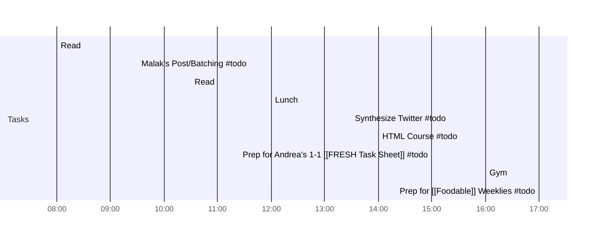

## Tuesday, July 20th 2021
[[21-07-19_Mo]] | [[21-07-21_We]] 

**Week**: [[21-07-W30]]
**Month**: July | [[21-07_Jul]]
**Year**: [[2021]]

----
## Day Planner


### Morning
- [x] 08:00 Read
- [x] 09:30 Malak's Post/Batching #todo
- [x] 10:30 Read
- [x] 12:00 Lunch
	
	
### Afternoon
- [x] 13:30 Synthesize Twitter #todo
- [x] 14:00 HTML Course #todo
- [x] 15:00 Prep for Andrea's 1-1 [[FRESH Task Sheet]] #todo
- [x] 16:00 Gym
- [x] 17:00 Prep for [[Foodable]] Weeklies #todo

# Morning Startup

### [[Gratitudes]]
> I'm Grateful for... 
> The guy who came up with the dictionary plugin
> The guy at the front of the desk at Fitness19 for letting us come in even though the card clearly says no
	> Lesson to learn from #people/Mak and a TikTok I saw: Ask for things. You will get them. Stop being afraid to ask for things and be a burden to others. 
>  Snowball, because he gives me peace of mind. I don't have to think when I'm with him. I think that's the power of pets and animals. 
>  [[HunterxHunter]]: although it's tiring watching the show, I cannot help but admire the work that went into the concept and manga
>  Janine, for praising me all the time. Good supervisor
>  Annelyz, for being so thorough with her answers. 
>  #people/Malak for exposing me to new cultures and getting over my fear of not saying the right things/being offensive. 

### [[Accomplishments]]
> Replied back to Trin. (albeit not in the best way)
> Got a pretty glute intensive workout in.
> Helped Mak with his PPT, and his mom with dinner (kind of)

### [[Lessons Learned]]
1. You do not actually have to spend 9-5 hours on work. Work diligently and strategically, and you'll maximize your time. Let's say you set three work tasks. That should only take about an hour each. Therefore, work from 9-12, and the rest of the day you can take off for other pursuits, like expanding your knowledge. You do have time to do everything. 
2. You don't really have to eat those chocolate crackers, even if they're satisfying in the moment. 

### What would make today great?
*1-3 actions that if completed today will be deemed a success.*
- [ ] 1 hr optimizing work
- [ ] 1 hr capturing information from all the sources
- [ ] 1 hr running
- [ ] Following my schedule

----
## Pages

I'm running on borrowed energy. If I depend too much on the coffee, then I won't be using my own powers developed. However, even as I write these pages at 12:22pm (the time when I usually would have come down from my morning coffee rush), I can say that I'm wired and ready to go. 

These days with Obsidian are unstructured. Usually, I would be following my gCal and focusing on other priorities and external tasks that need to get done. But another part of me is enchanted, being taken by the hand by in a mad pursuit for accumulation. Like I'm hoarding knowledge (ironic, since I don't really like to hoard much else).

I would say there was a change in levels with May (or whichever month I got really into spiritualism). And now, there's another level unlocked. Each choice I make is a deliberate attempt to become a more complex, refined individual. And for the most part, it's working. I wonder what the next year will bring? 

----
%% - metadata:
	- tags: #dailies [[Timestamps]] 


	```
aliases: ["July 20th, 2021","July 20, 2021","Jul 20, 2021","Jul. 20, 2021","7/20/2021","7-20-2021","2021-07-20","7.20.2021",]
created: ["2021.07.20 7:49 AM"]
```
